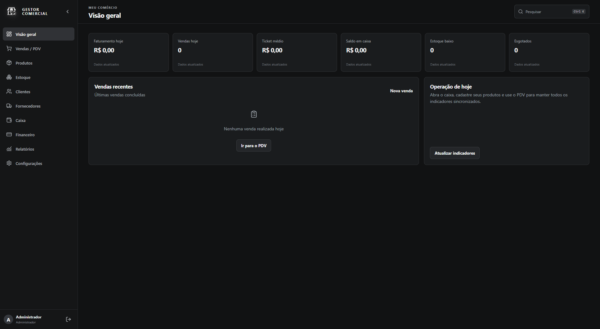
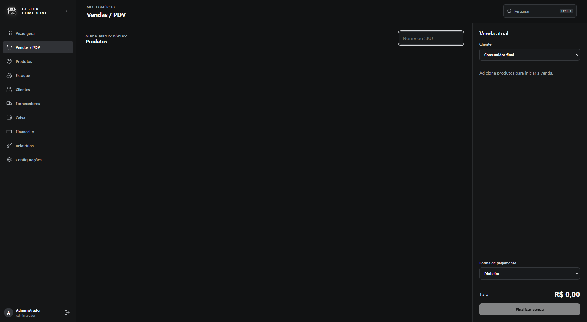
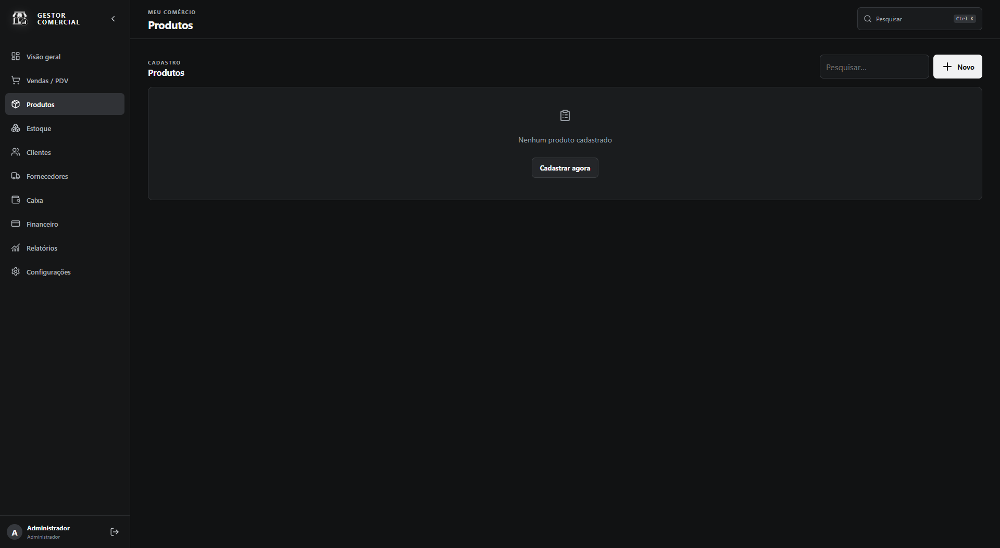
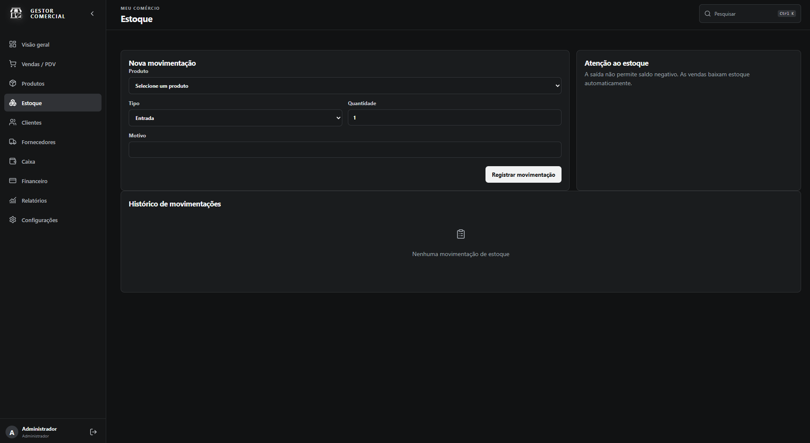
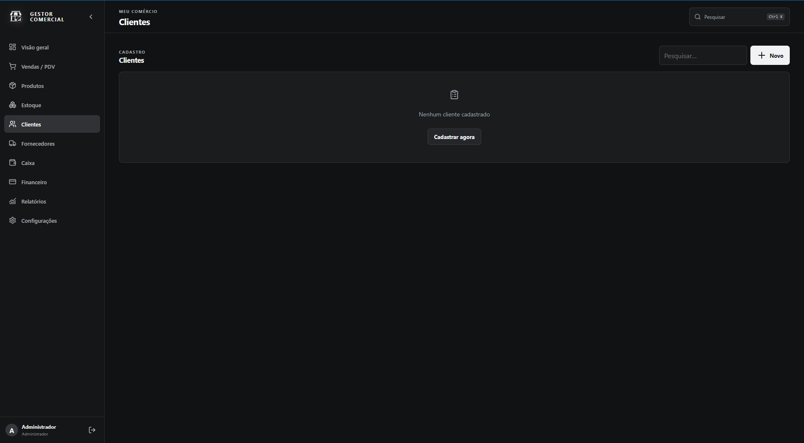
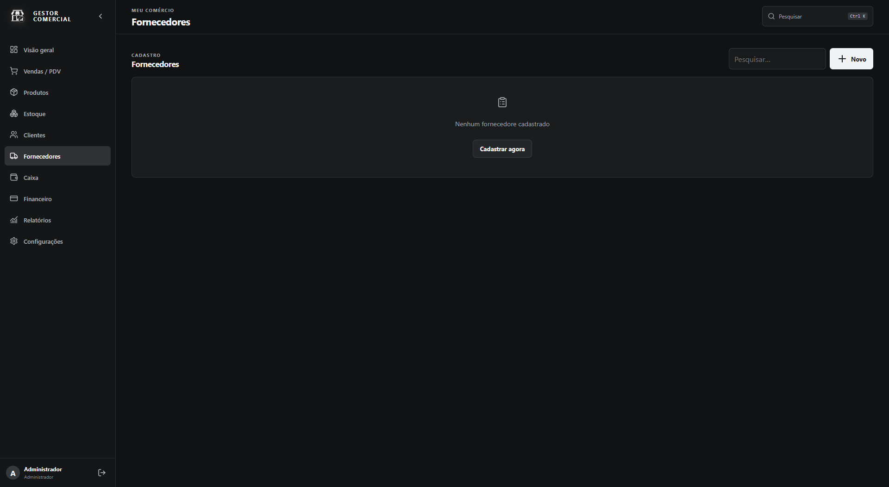
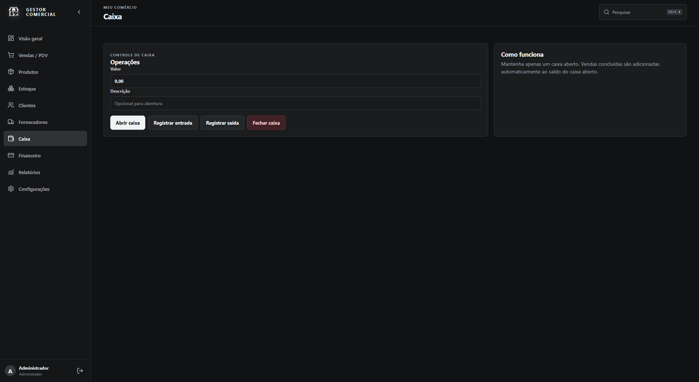
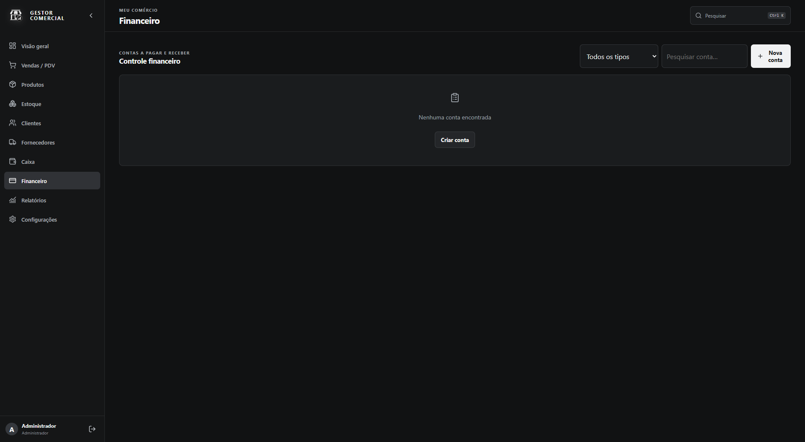
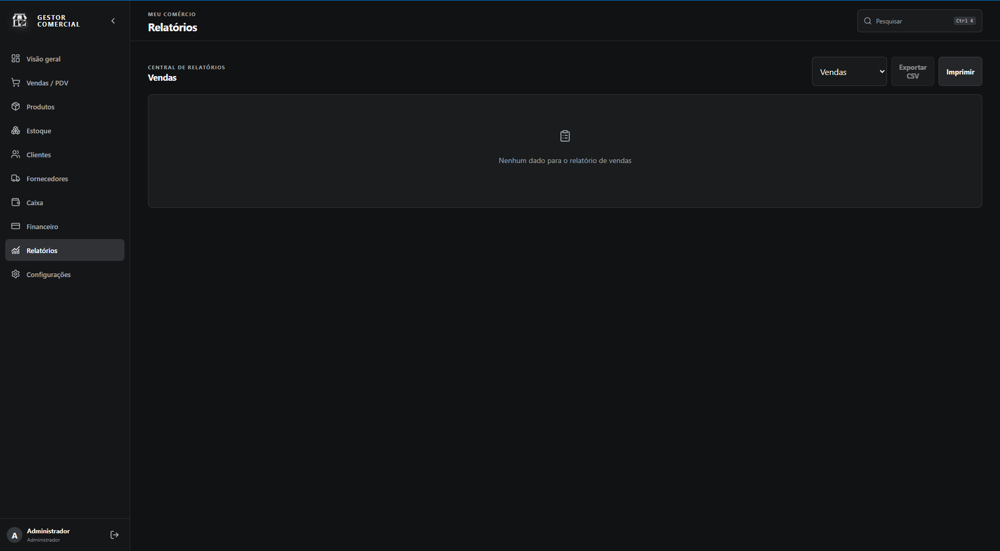
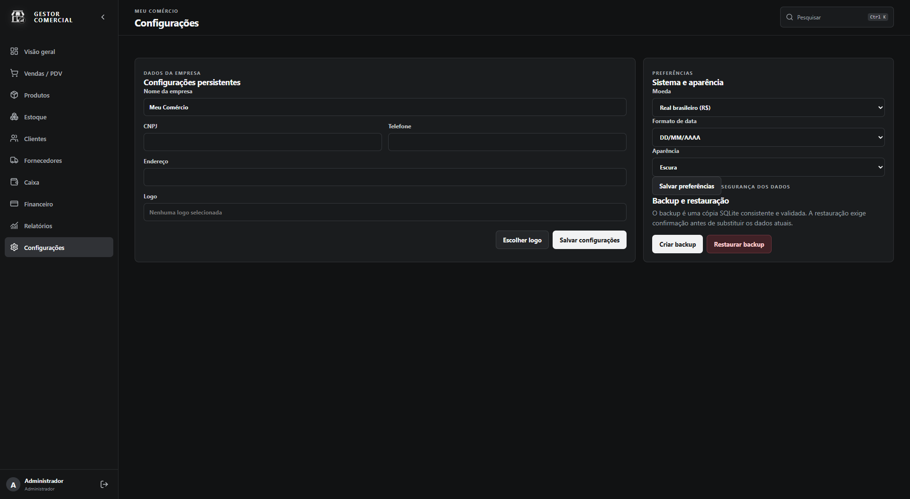

# Gestor Comercial

Aplicação desktop para gestão de pequenos comércios, projetada para operar localmente, com dados persistidos em SQLite e uma experiência focada em agilidade no balcão.

[**Baixar o instalador para Windows (v1.0.0)**](https://github.com/contapessoalcomputadorsoa-coder/SISTEMA-COMERCIAL-COMERCIO-B-W/releases/tag/v1.0.0)



## Visão geral

O Gestor Comercial centraliza a operação diária do negócio: cadastro de produtos, clientes e fornecedores, controle de estoque, PDV, caixa, financeiro, relatórios e backup. A interface é desktop-first, em português do Brasil e com identidade visual escura.

## Recursos

- Autenticação local e sessão de administrador
- Dashboard com indicadores de faturamento, vendas, ticket médio, caixa e estoque
- Cadastro e consulta de produtos, clientes e fornecedores
- PDV com carrinho, pagamento, baixa automática de estoque e registro no caixa
- Movimentações de entrada e saída de estoque com histórico
- Abertura, entradas, saídas e fechamento de caixa
- Contas a pagar e receber, com quitação, recebimento, cancelamento e integração ao caixa aberto
- Relatórios de vendas, produtos, estoque, clientes, financeiro e caixa
- Exportação de relatórios em CSV e impressão
- Configurações persistentes da empresa e preferências do sistema
- Backup SQLite validado e restauração com confirmação
- Pesquisa global por atalho `Ctrl + K`

## Interfaces

| Módulo | Tela |
| --- | --- |
| PDV |  |
| Produtos |  |
| Estoque |  |
| Clientes |  |
| Fornecedores |  |
| Caixa |  |
| Financeiro |  |
| Relatórios |  |
| Configurações e backup |  |

## Tecnologias

- [Tauri 2](https://tauri.app/) para o aplicativo desktop e instalador Windows
- [React](https://react.dev/) e [TypeScript](https://www.typescriptlang.org/) na interface
- [Vite](https://vite.dev/) no desenvolvimento e build do frontend
- [Rust](https://www.rust-lang.org/) na camada nativa
- [SQLite](https://www.sqlite.org/) com `rusqlite` para persistência offline

## Arquitetura

```text
src/                 Interface React, componentes e serviços
src/services/        Ponte tipada entre a interface e comandos Tauri
src-tauri/src/       Regras de negócio, migrations e acesso SQLite
docs/images/         Capturas de tela usadas nesta documentação
```

Os valores financeiros são armazenados em centavos inteiros, evitando imprecisão de ponto flutuante. Operações críticas de venda, estoque, caixa e financeiro são executadas em transações SQLite.

## Como executar

### Pré-requisitos

- Node.js 20 ou superior
- Rust estável com toolchain MSVC no Windows
- WebView2 Runtime (normalmente já disponível no Windows 10/11)

### Desenvolvimento

```bash
npm install
npm run tauri dev
```

### Credenciais iniciais

| Campo | Valor |
| --- | --- |
| Usuário | `admin` |
| Senha | `admin123` |

Altere as credenciais padrão antes de utilizar o aplicativo em produção.

### Build do instalador Windows

```bash
npm run tauri build
```

O instalador NSIS é gerado em `src-tauri/target/release/bundle/nsis/`.

## Qualidade

```bash
npm run check
cargo test --manifest-path src-tauri/Cargo.toml --lib
```

Os testes cobrem a criação da estrutura financeira e o ciclo de backup, alteração e restauração do banco SQLite.

## Licença

Projeto de uso privado. Defina uma licença antes de publicar ou distribuir o código.
